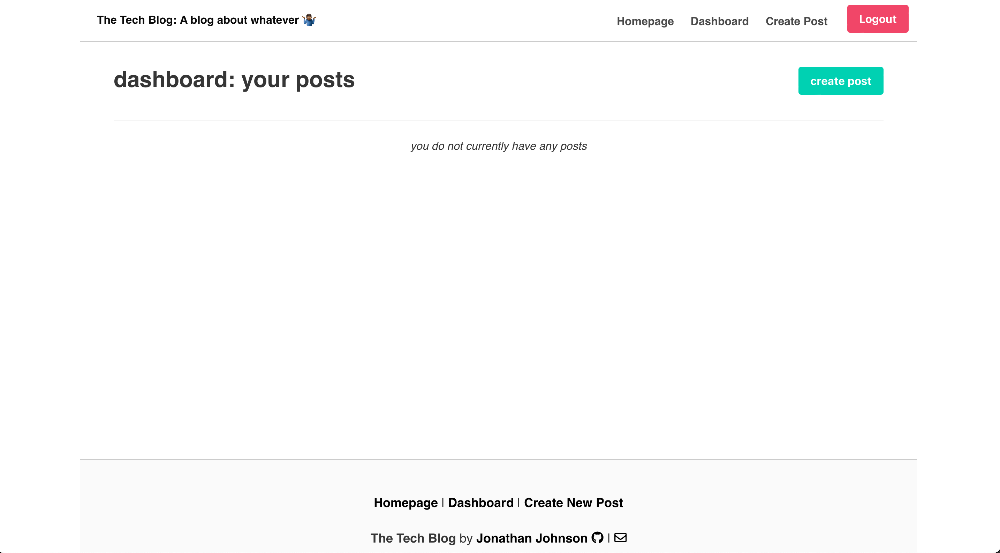
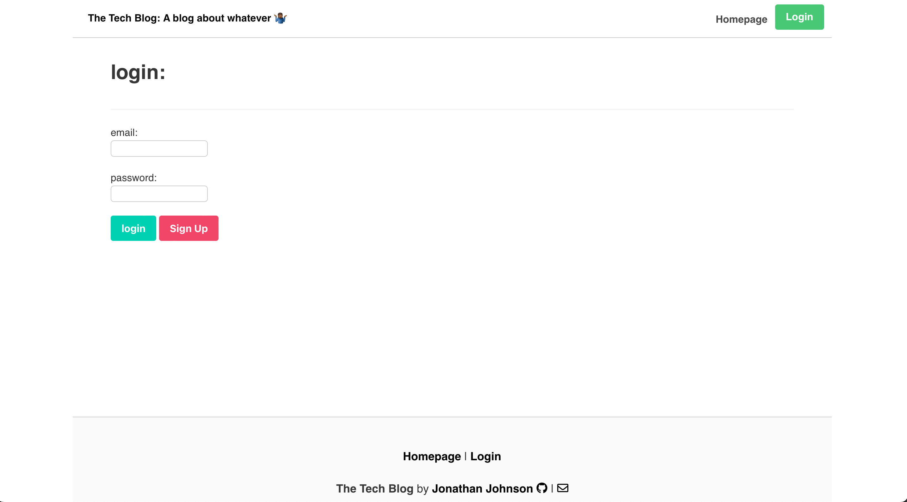
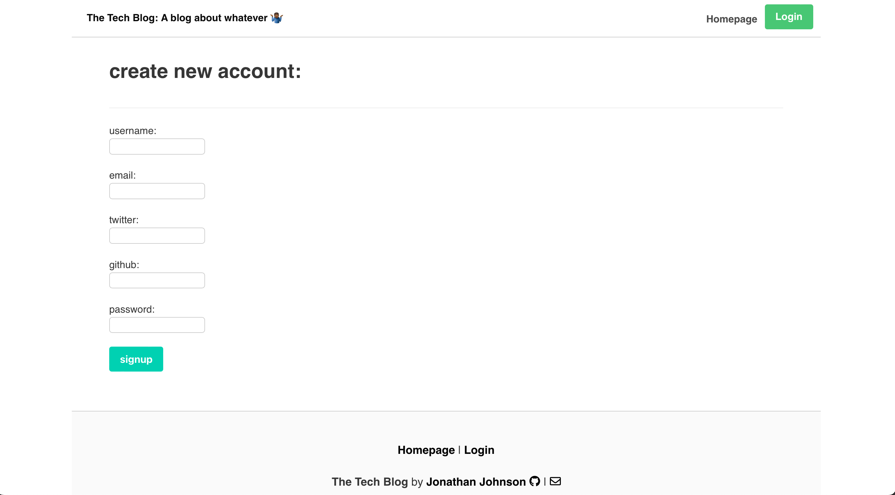
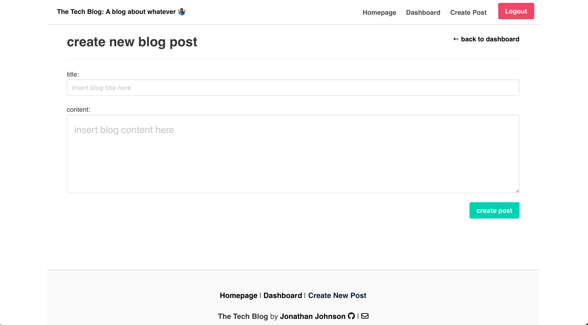
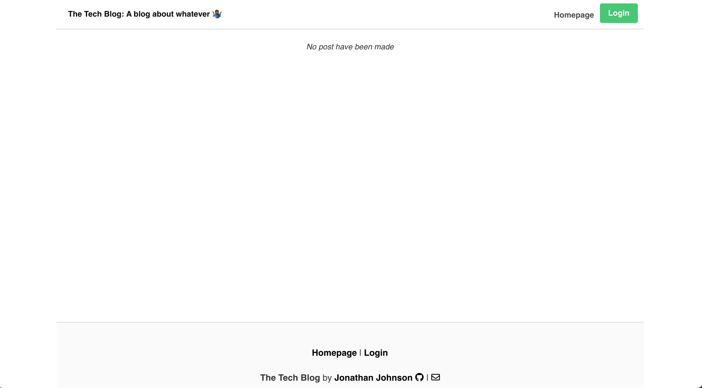

# The Tech Blog

Model-View-Controller (MVC): Tech Blog

## Objective

Writing about tech can be just as important as making it. Developers spend plenty of time creating new applications and debugging existing codebase, but most developers also spend at least some of their time reading and writing about technical concepts, recent advancements, and new technologies. A simple Google search for any concept covered in this course returns thousands of think pieces and tutorials from developers of all skill levels!
## Video Walkthrough link

https://user-images.githubusercontent.com/67285232/164023464-4c8f452d-b4d4-4ec8-9cb8-fc6d1ecb49d6.mp4


## Sceenshots of final page







## Link to deployed page

[Heroku page](https://shrouded-springs-43336.herokuapp.com)

## **License**

## Task

Task this week is to build a CMS-style blog site similar to a Wordpress site, where developers can publish their blog posts and comment on other developers’ posts as well. You’ll build this site completely from scratch and deploy it to Heroku. Your app will follow the MVC paradigm in its architectural structure, using Handlebars.js as the templating language, Sequelize as the ORM, and the express-session npm package for authentication.

## **Installation**

To install and set up the application, in CLI enter:

```sh
npm init -y
npm i express
npm i
```

You will also need to place a .env file in the root directory of the project, in order to connect to your MySQL database. Here's an example:

file: .env

```
DB_NAME= "tech_blog_db"
DB_PASSWORD= ""
DB_USER= "root"
```

---

## **Usage**

<sub><sup>This section assumes you have installed the application, and created the .env file in the root directory.</sub></sup>

To finish the set-up the application, complete the following steps:

1. Create a MySQL database on your local machine using the *schema.sql* file located in the /db/ directory(From the MySQL CLI, source db/schema.sql)
2. Seed the database with sample data to be used for testing purposes(Run *npm run seed* from inside the root directory of the project)

Now you're ready to start the application! You can start the server by running:

```
npm start
```

The server is running, now you can make requests to it through your desired method. If you're new to the backend, I suggest trying out [Postman](postman.com)

---

## **Built With**

- [Node.js](<https://nodejs.org/en/about/>)
- [Sequelize](https://www.npmjs.com/package/sequelize)
- [Express.js](https://www.npmjs.com/package/express)
- [Visual Studio Code](<https://code.visualstudio.com/>)

<>


## License

This is licensed under the MIT License.
